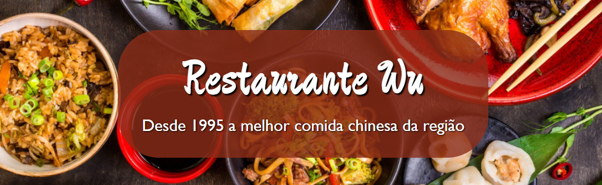

# Site "Restaurante Wu" 🥡

  

## 📝 Descrição

Projeto de página inicial de um restaurante chinês. Site feito para praticar códigos em HTML, CSS e Javascript e também design responsivo. 

O site também consume a API externa "Advice Slip JSON API", que gera frases de forma aleatória. A API foi inserida em uma seção da página inicial chamada "biscoito da sorte", em que o usuário é convidado à gerar um conselho de forma aleatória, simulando a abertura de um biscoito da sorte.

## 🧠 Aprendizado

* Praticar HTML e CSS
* Praticar Javascript
* Desenvolver site com design responsivo
* Desenvolver layout com base em projeto do Figma
* Consumir API externa

## 🎨 Design
### Paleta de cores:

-  `#8C2D18` vermelho
-  `#262526` preto
-  `#F2E1C2` bege

### Fontes:
* 'Gill Sans'
* 'Zhi Mang Xing'

## 🔗 Links

* Link para o site: https://elvisviana025.github.io/site-restaurante-wu/
* Projeto no Figma: https://www.figma.com/file/y1omvzsRwjYzXHnNWLQTFL/projetoRestaurante?node-id=0%3A1
